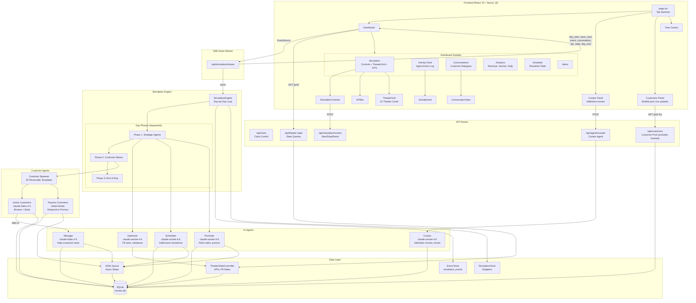
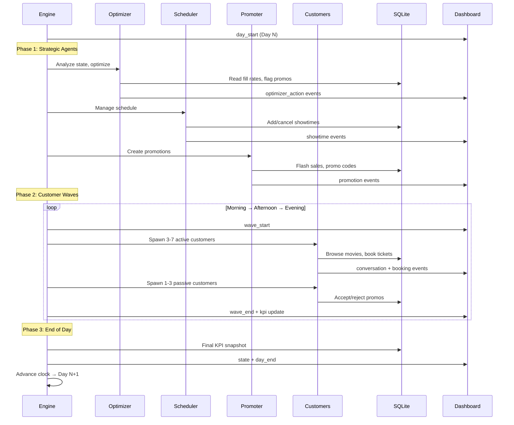
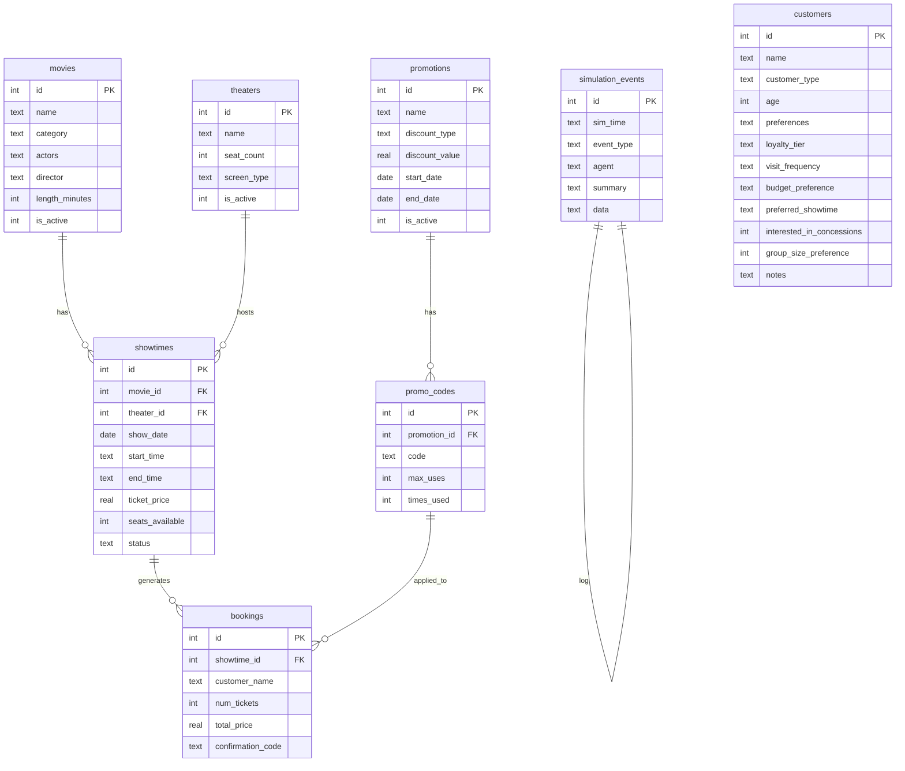

# CinemaAI Architecture

## System Overview

CinemaAI is a **multi-agent AI theater simulation** where autonomous AI agents run a cinema building. The system features accelerated day-by-day simulation, autonomous customer pools, and strategic agents that optimize, schedule, promote, and manage the theater — all visualized in a real-time dashboard.

## Architecture Diagram



## Day-Based Simulation Model

Each simulation "day" is a complete cycle that runs at the speed of the LLM API calls — no artificial timers.



## Customer Wave Structure

| Wave | Time | Active Customers | Passive Customers | Profile |
|------|------|-----------------|-------------------|---------|
| Morning | 10:00 | 3 | 1 | Matinee crowd, budget-conscious |
| Afternoon | 14:00 | 5 | 2 | Families, diverse |
| Evening | 18:00 | 7 | 3 | Peak hours, date nights |

## Database Schema



## Agent Details

| Agent | Model | Frequency | Role | Tools |
|-------|-------|-----------|------|-------|
| **Optimizer** | Sonnet 4.6 | Every day | Analyze fill rates, flag low-fill for promos, request extra screenings | `getTheaterState`, `flagForPromotion`, `addExtraScreening`, `getGenreDistribution` |
| **Scheduler** | Sonnet 4.6 | Every day | Add/cancel showtimes based on demand | `getTheaterAvailability`, `getActiveMovies`, `addShowtime`, `cancelShowtime` |
| **Promoter** | Sonnet 4.6 | Every day | Create flash sales and promotions for struggling showtimes | `detectLowFillShowtimes`, `createFlashSale`, `createPromotion`, `getPromotionPerformance` |
| **Curator** | Sonnet 4.6 | On demand | Curate movie catalog — add new films, retire underperformers | `addMovie`, `retireMovie`, `getGenreDistribution`, `getMoviePerformance`, `trendAnalysis` |
| **Manager** | Haiku 4.5 | Per active customer | Help customers find movies and book tickets | `getNowShowing`, `getShowtimes`, `bookTickets` |
| **Active Customer** | Haiku 4.5 | 3-7 per wave | Browse movies, talk to Manager, decide to book or leave | Talks to Manager agent |
| **Passive Customer** | Deterministic | 1-3 per wave | Receive promotions, accept/reject based on preferences | No LLM — rule-based decision |

## Key Design Decisions

1. **Day-based simulation**: No artificial timers. Each day runs as fast as API calls complete.
2. **Sequential phases, concurrent customers**: Agents run sequentially to avoid SQLite contention. Customers within a wave run concurrently via `Promise.allSettled`.
3. **Write queue mutex**: All DB writes go through an async mutex to prevent SQLITE_BUSY errors.
4. **SSE streaming**: Events stream in real-time — individual conversation results emit as each completes (not batched). Step-by-step `conversation_update` events show tool-call progress live.
5. **Singleton patterns**: DB connection, simulation clock, and engine are all singletons for consistent state.
6. **Shared SQLite DB**: All agents read/write the same database — single source of truth.
7. **DB-driven customer pool**: Customer spawner reads from the `customers` table (buyer → active, persuadable → passive). LLM-powered spawner API can generate new customers on demand.
8. **Passive customers are deterministic**: No LLM call — just probability-based acceptance of promos.
9. **Persistent tabs**: All tabs stay mounted (CSS display toggle) so SSE connections survive tab switches. Cross-component communication uses `window` custom events.
10. **Real-time agent visualization**: Manager/Promoter agent nodes with SVG connection lines to active customers. Live conversation feed shows step-by-step progress.

## Customer Pool & Agent Visualization

The **Customers** tab is a two-panel "Agent Theater" view:

### Left Panel — Physics Bubble Pool
- **Physics engine**: Velocity, gravity, repulsion between bubbles (requestAnimationFrame loop)
- **Bubble colors**: Green = buyer, amber = persuadable, gold glow = talking to Manager, gold border = talking to Promoter
- **Agent nodes**: Individual Manager (top-left) and Promoter (top-right) icons appear during active conversations
- **SVG connection lines**: Animated dashed lines from active customers to their agent
- **Active badges**: "Chatting" / "Promo" labels on customers in conversation
- **Spawn zone** (top): New customers drop in with physics
- **Exit zones** (bottom): Booked → bottom-left, Left → bottom-right
- **Auto-spawn**: Pool auto-refills via LLM spawner when below threshold

### Right Panel — Live Conversation Feed
- **Real-time step-by-step**: Each conversation card shows progress as it happens:
  - 🗣️ Greeting → 🔍 Browsing → 📋 Checking showtimes → 🎫 Booking → ✅ Booked / 🚶 Left
- **LIVE badge**: Pulses while agent is processing, with "thinking..." indicator
- **BOOKED/LEFT badges**: Final outcome on completed conversations
- **Timeline UI**: Left border connects all steps in a conversation
- **Auto-scroll**: Feed scrolls to latest conversation

### Cross-Tab Integration
- Simulation SSE events broadcast via `window` custom events
- Bubble pool reacts to simulation events even when Simulation tab is active
- All tabs stay mounted — no state loss on tab switch

## File Structure

```
src/
├── app/
│   ├── page.tsx                          # Dashboard + Simulation + Customers tabs (all mounted)
│   └── api/
│       ├── clock/route.ts                # Clock control
│       ├── theater-state/route.ts        # State queries
│       ├── customers/route.ts            # Customer pool (excludes booked)
│       ├── agents/
│       │   ├── curator/route.ts          # Curator agent
│       │   ├── customer-spawner/route.ts # LLM customer generator
│       │   └── customer-decide/route.ts  # LLM buying decisions
│       └── simulation/
│           ├── stream/route.ts           # SSE event stream
│           └── control/route.ts          # Start/stop/reset
├── lib/
│   ├── db.ts                             # SQLite singleton
│   ├── simulation-clock.ts               # Time control
│   ├── simulation-engine.ts              # Day-by-day orchestrator
│   ├── theater-state.ts                  # KPI/state controller
│   ├── event-store.ts                    # Event persistence
│   ├── write-queue.ts                    # Async mutex
│   ├── promoter-tools.ts                 # Shared promo functions
│   └── agents/
│       ├── types.ts                      # Shared types
│       ├── customer-spawner.ts           # DB-integrated spawner (fallback: 25 hard-coded)
│       ├── customer-active.ts            # Active customer runner
│       ├── customer-passive.ts           # Passive customer (deterministic)
│       ├── manager-agent.ts              # Manager (helps customers book)
│       ├── optimizer.ts                  # Optimizer (fill rate strategy)
│       ├── scheduler.ts                  # Scheduler (showtime management)
│       └── promoter-agent.ts             # Promoter (autonomous promos)
└── components/
    ├── Dashboard.tsx                     # Main dashboard with SSE + subtabs
    ├── SimulationControls.tsx            # Play/stop/reset + day/wave display
    ├── KPIBar.tsx                        # Live metric counters
    ├── TheaterGrid.tsx                   # 15 theater cards grid
    ├── TheaterCard.tsx                   # Individual theater visualization
    ├── ActivityFeed.tsx                  # Agent action log
    ├── ConversationView.tsx             # Customer dialogue viewer
    ├── CuratorPanel.tsx                  # Curator agent chat UI
    ├── CustomersPanel.tsx                # Physics bubble pool + live conversation feed
    ├── CustomerPoolLive.tsx              # Compact pool for SimulationPanel embed
    └── TimeControl.tsx                  # Time/simulation clock

scripts/
├── run-migration.js                     # Run migrations (npm run migrate)
├── seed-customers.js                    # Seed 20 customers (npm run seed:customers)
├── add-customer.js                      # Add single customer
└── show-schema.js                       # Print DB schema (npm run db:schema)

migrations/
├── 001_curator_movies.sql               # synopsis, poster_url, is_active on movies
├── 002_bookings_promotions.sql          # promotions, promo_codes, bookings
└── 003_customers.sql                    # customers table
```
